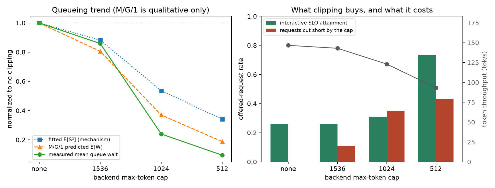

# SLOServe

SLOServe is an **external admission, queueing, and routing layer that sits in front of a real
vLLM server** for mixed interactive + batch LLM inference. It decides *whether* a request is
admitted and *in what order* requests are forwarded to the engine — it never modifies vLLM's
internal token scheduler. This keeps the layer applicable to any OpenAI-compatible engine and
makes the boundary an honest one: all measured effects come from external ordering, not from
changing how the engine batches tokens.

The goal is a single-GPU study of scheduling policy: given the same real engine and workload,
how do different admission/ordering policies trade off SLO attainment, latency, throughput,
fairness, and rejection?

## What it does

- **Three scheduling policies** behind one interface, switched by config:
  - `fcfs` — first-come-first-served (baseline).
  - `static_priority` — interactive always ahead of batch, FCFS within a class.
  - `slo_aware` — a normalized score combining a shortest-job term, deadline **slack** (EDF-style
    urgency), and accumulated **waiting**, plus a hard **aging** ceiling that guarantees a bounded
    worst-case wait. Optional multi-level aging and a learned output-length estimate.
- **Reproducible workloads**: fixed-rate and bursty **Poisson** arrivals; configurable
  interactive:batch mix and concurrency; a realistic heavy-tailed output-length model (per-kind
  log-normal mixture) for length-uncertainty studies. Everything is seeded.
- **Joint metrics**: throughput, TTFT, TPOT, P50/P95/P99 latency, queue waiting, SLO attainment
  per class, rejection rate, Jain fairness, and GPU utilization/memory — always reported together,
  so a policy cannot look good by, say, silently dropping hard requests.
- **A sweep harness** that runs each configuration against a live vLLM endpoint and writes
  request-level JSONL/CSV, completeness reports, config hashes, environment metadata, and aggregate
  `sweep-results.csv`/`.json` under `results/raw/`. Every number in this repo is reproducible from
  that saved data.

## What was tested, and what was found

All experiments run on one NVIDIA RTX 4080 Laptop GPU (12 GB) with `Qwen/Qwen3-0.6B` and a pinned
vLLM 0.27.1 stack. Full methods, session boundaries, and figures are in
[`docs/REPORT.md`](docs/REPORT.md); the running lab notebook is [`docs/LEARNING_NOTES.md`](docs/LEARNING_NOTES.md).
Headline saturation numbers use **six independent seeds** and are reported as mean ± std, because
the saturation knee is run-to-run sensitive (the seed fixes the workload but not vLLM's
continuous-batching timing).

**Policy comparison at saturation (rps=3.0, 6 seeds).** Static priority has the strongest and most
stable interactive SLO (0.98 ± 0.01) but the worst tail latency and starves batch under deeper
overload. FCFS is weakest and most volatile (0.57 ± 0.31). SLO-aware is the **balanced choice**:
interactive 0.92 ± 0.07 (near static) while also holding the best tail latency, throughput, full
fairness, and no batch starvation. SLO-aware does **not** beat static priority on interactive SLO —
it wins on the whole basket, not on that one axis.


**Aging is a real trade-off.** The hard aging ceiling guarantees a bounded worst-case wait, but a
threshold set below the saturated queue wait promotes *every* request into a class-blind
oldest-first tier — i.e. SLO-aware quietly degrades to FCFS. The threshold, not the number of
tiers, is the knob that governs SLO differentiation:

- **Multi-level aging (Week 4)** — generalizing the single ceiling to K graduated tiers gives **no**
  interactive-SLO benefit (K=1 best at 0.48 ± 0.20); more tiers just trade interactive urgency for
  a shorter worst-case wait and higher batch SLO.
- **Adaptive ceiling (Week 5)** — floating the threshold on live queue congestion **fails**
  (interactive SLO 0.39 vs 0.83–0.91 for fixed thresholds). The useful by-product: the default 3 s
  threshold was simply mis-set — raising it to 10–30 s lifts interactive SLO (0.83 → 0.91) and
  collapses the run-to-run std (0.25 → 0.08–0.10), explaining most of the earlier "irreducible"
  saturation variance.


**Output-length estimation (Week 6, under correction).** The first expK-A implementation sampled a
heavy-tailed target and sent it as vLLM's `max_tokens`. A real-output audit later showed that this is
only a ceiling: the model often stops early, and sampled targets correlate only weakly with realized
output (`r≈0.33` in the six no-clip seeds). The earlier 0.74/0.65/0.51 comparison therefore measures
target-cap proxy scheduling, not true/oracle output-length scheduling, and is retained as diagnostic
data rather than a performance conclusion. A default-off exact-length mode now sends matching
`min_tokens` and `max_tokens`, and expK-B below runs entirely under that explicit semantic
boundary.

**Length-aware output clipping works, and it is the first intervention here that does (Week 6).**
Instead of reordering the queue, admission truncates it: the learned predictor flags long-looking
requests and dispatches them with a reduced backend `max_tokens`. Under a heavy-tailed workload this
follows the M/G/1 mean-wait law `E[W] = λE[S²]/(2(1−ρ))`, which is driven by the *second* moment of
service time. Capping at 512 tokens cuts mean queue wait **10.6x** (2.78 → 0.26 s) and lifts
interactive SLO attainment from **0.26 to 0.73** — a bigger interactive gain than any scheduling
policy in Weeks 3–5 produced. The mechanism is the predicted one: mean service time falls 1.75x
while `E[S²]` falls 2.94x. It is **not free** — 43% of requests are cut short by ~1019 tokens each
and token throughput drops 36%, so this is a utility-for-latency exchange rather than a scheduling
win. A concurrency-scaled M/G/1 baseline reproduces the ordering and direction at every cap but
over-predicts absolute wait about two-fold, and is reported only as a qualitative trend check.



Negative and surprising results are kept and explained rather than trimmed; retained raw runs back
every claim above.

## Environment

RTX 4080 Laptop GPU (12 GB) · `Qwen/Qwen3-0.6B` (revision `c1899de2…`) · vLLM 0.27.1 ·
torch 2.13.0+cu130 · CPython 3.11.14 · [`uv`](https://docs.astral.sh/uv/). vLLM runs under native
Ubuntu (not Windows).

## Reproducing the experiments

```bash
uv sync
uv lock --check
uv run ruff check .
uv run ruff format --check .
uv run pytest
```

Start the pinned vLLM server from a versioned server config, then run a router-side sweep against
that already-running endpoint:

```bash
scripts/serve.sh configs/base.yaml
uv run sloserve sweep --config configs/sweeps/expG-robust.yaml
```

Sweep configs live in [`configs/sweeps/`](configs/sweeps) (e.g. `expG-robust` for the saturation
robustness study, `expI-multiseed` for multi-level aging, `expJ-adaptive` for the ceiling study,
`expK-A-length-source` for length estimation, `expK-B-clipping` for output clipping).
Experiment D changes server-side parameters, so each
`serve-D-*.yaml` / `expD-*.yaml` pair needs a separate vLLM restart. Regenerate figures from the
saved aggregate CSVs:

```bash
uv run sloserve plot --results results/raw/<experiment>/sweep-results.csv --out results/figures
uv run python scripts/plot_week3_extra.py
uv run python scripts/analyze_expkb.py
```

## Repository layout

```text
configs/                  Versioned experiment + server + sweep configurations
src/sloserve/router/      Request models and the scheduling-policy interface + policies
src/sloserve/workload/    Arrival processes, request generation, length predictor, HTTP backend
src/sloserve/experiments/ Benchmark runner, correctness/starvation runner, sweep harness
src/sloserve/analysis/    Metrics aggregation and plotting
scripts/                  serve.sh and figure regeneration
results/raw/              Retained per-run request-level data and aggregate CSV/JSON
results/figures/          Figures regenerated from results/raw/
docs/                     REPORT.md (technical report), LEARNING_NOTES.md (lab notebook), progress
tests/                    Unit and smoke tests
```

No performance claim belongs in this repository unless it can be regenerated from committed raw
JSON/CSV data and a versioned configuration.
