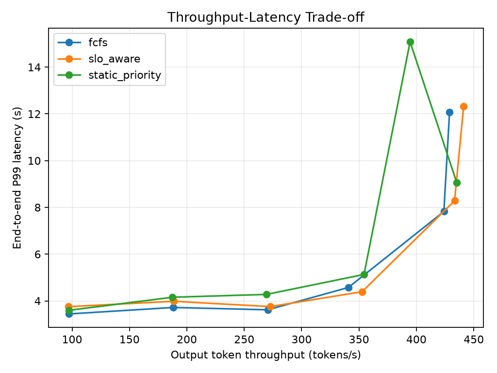
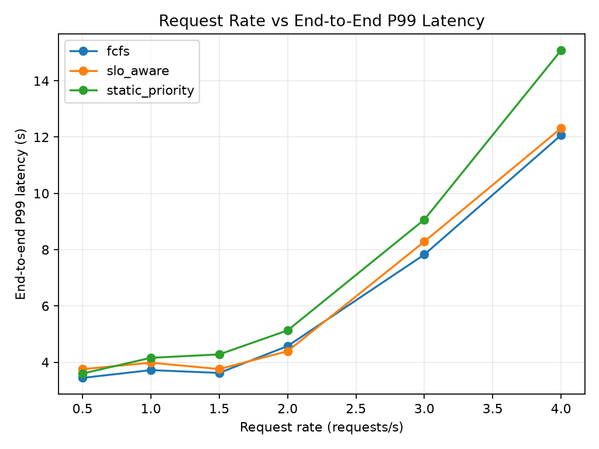
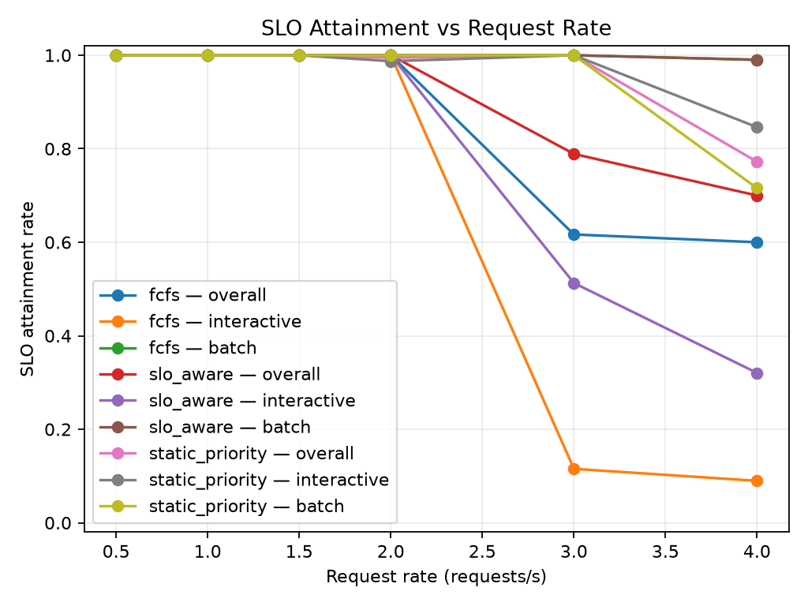
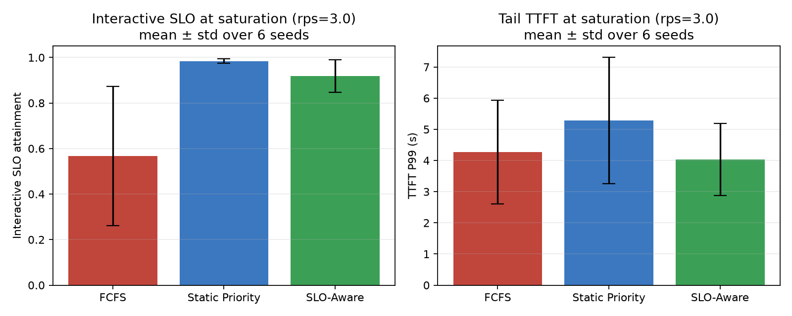
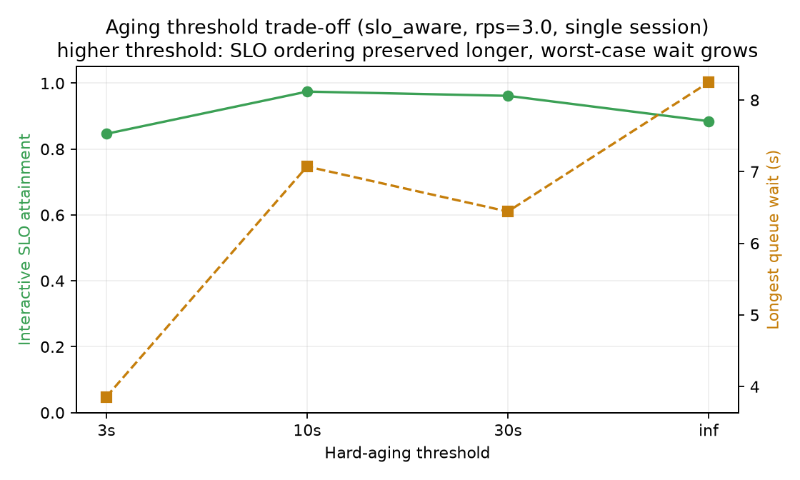
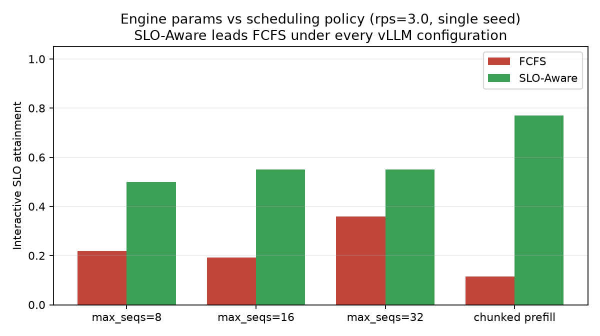
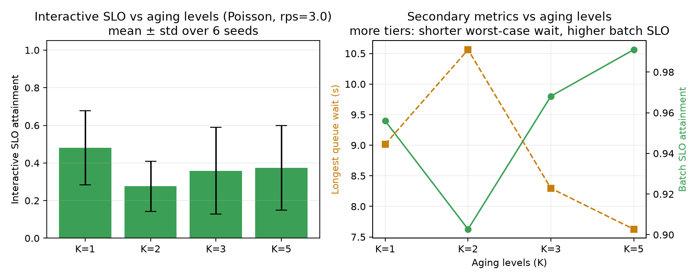
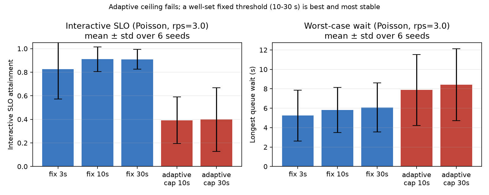
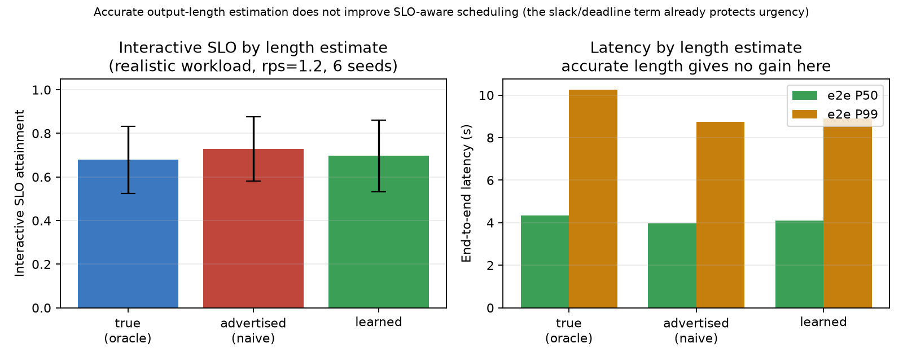

# SLOServe: SLO-Aware External Scheduling for Mixed LLM Inference Workloads

## Abstract

SLOServe is an external admission, queueing, and routing layer for mixed interactive and batch
requests sent to a real vLLM OpenAI-compatible server. It compares first-come, first-served
(FCFS), static class priority, and a dynamic SLO-aware policy that combines normalized service
time, remaining slack, waiting time, and hard aging. On a single NVIDIA GeForce RTX 4080 Laptop
GPU, all policies are effectively equivalent below capacity, but they diverge once requests
queue. Across six independent seeds at 3.0 requests/s, static priority provides the strongest and
most stable interactive SLO, while SLO-aware scheduling provides a balanced operating point across
interactive attainment, overall attainment, tail latency, throughput, fairness, and batch
protection. The evaluation also exposes a liveness-versus-differentiation tension: class-blind hard
aging bounds waiting but can erase SLO ordering under saturation. Results at the saturation knee
have high execution-timing variance, so direction-level conclusions are more reliable than any
single absolute attainment value.

## 1. Introduction and motivation

LLM inference services often combine latency-sensitive interactive requests with longer batch
requests. Interactive users care about time to first token (TTFT) and tail latency, whereas batch
jobs can tolerate more waiting but consume substantially more token-processing work. A simple FCFS
queue ignores this asymmetry. When a large batch request occupies the head of the queue, a short
interactive request can miss its service-level objective (SLO) even though prioritizing it would
have little effect on total work. At the opposite extreme, unconditional interactive priority can
protect one class while starving batch traffic during deep overload.

SLOServe studies the middle ground. Its central question is whether an external scheduler can use
request length, latency budget, and accumulated waiting to improve mixed-workload behavior without
requiring changes to the inference engine. This framing matters operationally: a black-box or
separately managed engine may expose an OpenAI-compatible API without exposing a stable internal
scheduling interface. An upstream layer can still control admission order, bound concurrency, and
retain request-level evidence.

The evaluation is organized around load intensity, workload mix, policy components, aging, and
engine parameters. The main finding is deliberately narrower than “one policy wins.” Below
capacity, ordering has no material role because requests do not queue. Under contention, static
priority most strongly protects interactive attainment but eventually harms batch traffic and has
the worst tail latency. The SLO-aware policy is instead a balanced choice: it stays near static
priority on interactive attainment in the multi-seed saturation study while providing the best
overall tail latency and throughput there, full fairness, and no batch starvation. This report does
not claim that SLO-aware scheduling beats static priority on interactive SLO.

## 2. System design

SLOServe is an **external admission, queueing, and routing layer in front of a real vLLM
OpenAI-compatible server**. It never modifies vLLM's internal token scheduler. The external router
decides which waiting request is admitted next and limits the number of calls concurrently sent to
the server; vLLM remains responsible for its own continuous batching and token-level execution.

Three policies are selectable through configuration alone:

- `fcfs` orders requests by arrival and sequence.
- `static_priority` places interactive requests ahead of batch requests and preserves FCFS order
  within each class.
- `slo_aware` dynamically scores each request from its latency budget, estimated service time,
  remaining slack, and accumulated waiting.

The corrected SLO-aware score is dimensionally consistent. For a request, let

```text
budget = deadline - arrival
service_time_s = input_tokens * input_token_seconds
               + max_output_tokens * output_token_seconds
slack = deadline - now - service_time_s
waiting = now - arrival
score = (cost_weight * service_time_s
       + slack_weight * slack
       - waiting_weight * waiting) / budget
```

Lower scores receive higher priority. The defaults are `input_token_seconds = 0.0005` and
`output_token_seconds = 0.01` s/token. These are coarse service-time estimates rather than fitted
performance claims; normalization makes the score robust to their exact value. The `cost_weight`
term is a normalized shortest-job term, favoring smaller estimated service times. The slack term
represents normalized remaining-time urgency, and waiting progressively improves a queued
request's priority.

Hard aging provides liveness independently of the soft score. Once
`waiting >= aging_threshold_s`, a request enters an absolute top tier keyed as
`(0.0, arrival_time, sequence_id)`. This tier is oldest-first and class-blind, giving a bounded
worst-case wait. It also creates a design tension: under sustained saturation, many requests can
enter that tier, at which point class and SLO differentiation collapse toward arrival order.

The interactive targets are 1500 ms TTFT and 10000 ms end-to-end latency. Batch targets are
10000 ms TTFT and 120000 ms end-to-end latency. These distinct budgets let the dynamic policy
compare urgency across classes instead of relying only on a binary class label.

A methodological finding emerged during Week 3. An earlier version represented request length in
abstract cost units and subtracted that estimate from a deadline measured in seconds. The mixed
units dominated slack and penalized short-deadline interactive requests. Week 3 corrected the
model to the seconds-based service-time form above and treated all earlier SLO-aware experiment
rows as stale. FCFS and static-priority rows were unaffected because they do not use this score.

## 3. Methodology and environment

The default workload uses fixed arrivals, 60 measured requests per run, 3 repetitions, 5 warmup
requests, and random seed 20250825 unless the experiment sweeps that dimension. The default class
mix has `interactive_fraction = 0.5`. The external router uses `max_in_flight = 4` and
`queue_capacity = 256`.

Interactive requests contain 64–256 input tokens and request 32–128 output tokens. Batch requests
contain 512–2048 input tokens and request 128–512 output tokens. The evaluation records TTFT, time
per output token (TPOT), end-to-end P50/P95/P99 latency, output-token throughput, overall and
per-class SLO attainment, longest queue wait, Jain fairness index, failures, timeouts, and GPU
utilization, memory, and power.

Experiments ran on one NVIDIA GeForce RTX 4080 Laptop GPU with 12282 MiB memory, driver
580.178.04, and CUDA 13.0. The software environment used Python 3.11.14, PyTorch
2.13.0+cu130, and vLLM 0.27.1. The model was `Qwen/Qwen3-0.6B` at revision
`c1899de289a04d12100db370d81485cdf75e47ca`. During the runs, GPU utilization was approximately
55% with a 61% peak, memory peaked at 6136 MiB, and mean power was approximately 77 W.

The experiment tooling separates workload generation, external routing, request metrics, GPU
sampling, sweep orchestration, and plotting. The command
`sloserve sweep --config <yaml>` runs a router-side parameter sweep against an already-running
server and writes aggregate `sweep-results.csv` and `sweep-results.json` files. The `sloserve plot`
command and `scripts/plot_week3_extra.py` regenerate every figure purely from the saved sweep
CSVs. Figures are therefore auto-generated from raw data rather than manually transcribed.

All raw request-level JSONL and CSV files, per-run completeness reports, configuration hashes, and
environment metadata are retained under `results/raw/`. The aggregate CSVs are derived from those
request facts and are sufficient to regenerate the figures. Warmup, fixed seeds, repeated runs,
and retained failure information support review without implying determinism in vLLM's internal
execution timing.

## 4. Results

### B. Request-rate ladder

The rate ladder spans 0.5–4.0 requests/s. The FCFS and static-priority rows come from an initial
session; the SLO-aware rows come from the post-fix session. They are combined to show the load
trend, but this session boundary must be kept in view when interpreting fine differences.

Output-token throughput plateaus around 430 tok/s at 3.0 requests/s, identifying the approximate
capacity region. Queueing begins between 1.5 and 2.0 requests/s. At rates up to and including
2 requests/s, all three policies achieve approximately 1.00 interactive SLO attainment. At
3.0 requests/s, interactive attainment is 0.12 for FCFS, 1.00 for static priority, and 0.51 for
SLO-aware. At 4.0 requests/s, it is 0.09 for FCFS, 0.85 for static priority, and 0.32 for
SLO-aware. Static priority's batch SLO falls to 0.72 at 4.0 requests/s, indicating that batch
starvation begins, while SLO-aware retains 0.99 batch attainment.







### G. Saturation robustness across seeds

The headline saturation study evaluates the three policies at 3.0 requests/s across six
independent seeds and reports mean ± standard deviation. FCFS achieves interactive SLO
0.57±0.31, overall SLO 0.80±0.14, TTFT P99 4.27±1.66 s, end-to-end P99
6.86±1.60 s, throughput 438±16 tok/s, and Jain fairness 0.87±0.15.

Static priority achieves interactive SLO 0.98±0.01, overall SLO 0.99±0.00, TTFT P99
5.28±2.02 s, end-to-end P99 7.94±2.16 s, throughput 433±14 tok/s, and Jain
fairness 1.00±0.00. SLO-aware scheduling achieves interactive SLO 0.92±0.07, overall
SLO 0.96±0.03, TTFT P99 4.03±1.15 s, end-to-end P99 6.55±1.18 s,
throughput 446±19 tok/s, and Jain fairness 1.00±0.01. Batch SLO is 1.00 for all three.

Static priority is strongest and most stable on interactive attainment in this study. SLO-aware
does not exceed it on that metric. Instead, SLO-aware combines near-static interactive attainment
with the best overall TTFT P99, end-to-end P99, and throughput among these results, while retaining
full fairness and batch protection. FCFS is both lower and substantially more variable on
interactive attainment.



### C. Workload mix

At 2.0 requests/s, policy differences depend strongly on class composition. With interactive
fraction 0.2, interactive SLO attainment is 0.48 for FCFS, 1.00 for static priority, and 0.97 for
SLO-aware; FCFS has Jain fairness 0.89. With interactive fraction 0.5, attainment is 1.00 for
FCFS, 0.97 for static priority, and 1.00 for SLO-aware. With interactive fraction 0.8, all three
reach 1.00.

The divergence appears only when interactive traffic is the minority contending with the bulk of
batch work. At the balanced and interactive-majority points, the system has enough opportunity to
serve interactive requests without scheduling policy becoming decisive.

### E. SLO-aware ablation

The single-session ablation at 3.0 requests/s reports interactive SLO attainment of 0.60 for the
full policy, 0.47 without slack, 0.46 without the length estimate, and 0.92 without aging. Removing
either the slack term or the normalized shortest-job term reduces interactive attainment to about
0.46. Disabling aging reaches static priority's level of 0.92 in this session. This isolates the
class-blind hard-aging tier as the component that caps interactive SLO under saturation: it protects
liveness by promoting old requests regardless of class, but that protection weakens interactive
differentiation.

### F. Aging-threshold trade-off

The single-session aging sweep at 3.0 requests/s measures interactive SLO attainment and longest
queue wait together. At a 3 s threshold, they are 0.85 and 3.86 s. At 10 s, they are 0.97 and
7.07 s. At 30 s, they are 0.96 and 6.44 s. With aging disabled (∞), they are 0.88 and 8.25 s.
Higher thresholds preserve SLO-based ordering for longer but increase worst-case waiting.

At the 30 s point, the hard tier never fires because the longest wait is 6.44 s, below the 30 s
threshold. The 30 s and ∞ configurations should therefore have identical dispatch order. Their
0.96 versus 0.88 attainment difference is pure vLLM execution-timing noise of approximately 0.08,
which calibrates the noise floor at the saturation knee rather than demonstrating an aging effect.



### D. Engine-parameter sweep

The engine-parameter sweep runs at 3.0 requests/s with one seed, restarting vLLM for every
combination. Interactive SLO attainment for FCFS versus SLO-aware is 0.22 / 0.50 with
`max_num_seqs=8`, 0.19 / 0.55 with `max_num_seqs=16`, and 0.36 / 0.55 with
`max_num_seqs=32`. With chunked prefill enabled at `max_num_seqs=16`, the corresponding values are
0.12 / 0.77.

SLO-aware leads FCFS under every tested engine configuration, showing that the external scheduling
benefit is orthogonal to and stacks with engine tuning. Finer parameter-to-parameter trends remain
single-seed observations within the saturation noise and should not be treated as stable rankings
among engine configurations.



### H. Poisson arrivals (single session)

Sections B–G drive the workload with a fixed inter-arrival schedule. To confirm the policy ordering is not an artifact of evenly spaced arrivals, this section replaces the schedule with a Poisson process (exponential inter-arrival gaps, rate 3.0 rps, seeded) at the saturating load point. A single seeded session reproduces the fixed-arrival ordering on interactive SLO attainment: static priority leads (0.86), SLO-aware is intermediate (0.28), and FCFS trails (0.14), with no rejections and full batch SLO for all three. This is a directional single-session check rather than a multi-seed estimate; the run-to-run variance quantified in section G applies here as well, so the absolute numbers carry the same caution. The ordering, not the magnitudes, is the takeaway.

### I. Multi-level aging (multi-seed)

The hard-aging rule in section F promotes any request past a single waiting threshold into one class-blind, oldest-first tier — the mechanism behind the FCFS degradation at saturation. A natural hypothesis, drawn from multi-level feedback schedulers, is that replacing the single threshold with K graduated age tiers would preserve SLO ordering longer: requests below the ceiling would still be ranked by their SLO score within each tier. We implemented this as a K-level generalization (K=1 exactly reproduces the prior binary policy) and swept K in {1, 2, 3, 5} under Poisson arrivals at rps=3.0, each K replayed over the same six seeds used in section G.

The hypothesis is not supported. Interactive SLO attainment is highest at K=1 (0.48 ± 0.20) and no multi-level setting improves on it (K=2: 0.28 ± 0.13; K=3: 0.36 ± 0.23; K=5: 0.37 ± 0.23). The per-K standard deviations (0.13–0.23) are large relative to the gaps between the means, so the honest reading is not "K=1 wins" but "additional aging tiers provide no measurable interactive-SLO benefit" — the apparent K=1 to K=2 drop seen in a single seed is largely within run-to-run noise, which the multi-seed sweep makes explicit.

The secondary metrics reveal a coherent trade rather than a free lunch. As K grows, the longest queue wait falls (9.0 s at K=1 to 7.6 s at K=5) and batch SLO attainment rises (0.956 to 0.991), while interactive SLO and Jain fairness soften. Graduated tiers make accumulated waiting override the SLO score earlier and more often, redistributing service from interactive requests toward bounded worst-case wait and batch completion. Multi-level aging is therefore a knob that trades interactive urgency for starvation-bound tightness, not a way to recover the SLO differentiation that saturation erases; the lever that actually governs that differentiation remains the ceiling position itself (section F).



### J. Adaptive ceiling threshold (multi-seed)

Sections F and I both point to the aging ceiling's *position* — not its granularity — as the knob that governs SLO differentiation at saturation. A fixed `aging_threshold_s` cannot be right across load regimes: too low and it swallows the whole saturated queue into the class-blind ceiling (the FCFS degradation of section F); too high and it is slow to bound the worst-case wait at light load. This section tests an adaptive ceiling that floats the threshold with live congestion, `clamp(margin * median_queue_wait, floor, cap)`, against three fixed thresholds (3 s, 10 s, 30 s) under Poisson arrivals at rps=3.0, each variant over the same six seeds. A cap preserves the finite worst-case-wait guarantee.

The adaptive ceiling fails, decisively and on both axes. Interactive SLO attainment is 0.39 ± 0.20 (cap 10 s) and 0.40 ± 0.27 (cap 30 s), against 0.83 ± 0.25 (fixed 3 s), 0.91 ± 0.11 (fixed 10 s), and 0.91 ± 0.08 (fixed 30 s); the adaptive variants also carry the *longest* worst-case waits (7.9–8.4 s versus 5.2–6.1 s for the fixed thresholds). Floating the threshold on the median in-queue wait is a destabilizing signal: Poisson bursts inject fresh, zero-wait requests that pull the median down exactly when a burst arrives, lowering the threshold and dumping mid-aged requests into the class-blind ceiling at the worst moment, while a uniformly aged queue raises it. The threshold thus moves opposite to need and thrashes the ordering, degrading interactive SLO and the tail together. (The mechanism is offered as the plausible reading of the aggregate result, not a per-dispatch trace.)

The sweep's more useful result is a negative-space finding about the fixed knob itself. The 3 s threshold that produced the section-G saturation variance is simply mis-set for this regime: raising it to 10–30 s lifts interactive SLO (0.83 → 0.91) and, more strikingly, collapses the run-to-run standard deviation (0.25 → 0.08–0.10). Much of the Week-3 saturation-knee variance was therefore not irreducible execution-timing noise but a threshold set low enough that most requests aged into the order-erasing ceiling, leaving the outcome hostage to dispatch timing. The lever is real, but the right way to pull it here is a better-calibrated constant, not a congestion-reactive controller.



### K. Output-length estimate: true vs advertised vs learned (multi-seed)

Weeks 3–5 hold output length fixed as a known per-request cap. In real serving the actual output length is unknown at admission and heavy-tailed, so the SLO-aware service-time estimate must rely on a prediction. To study this we replace the workload with a realistic model: each request's true output length is drawn from a per-kind log-normal mixture (pooled shape referencing log-normal with mu=7, sigma=0.7, following Yang et al.'s queueing analysis), the model generates to that length, and the scheduler sees only a coarse prompt kind and a loose 2048-token advertised cap. A bucket-median length predictor trained offline (held-out MAE 381 tokens versus 1043 for the advertised-cap constant) supplies the learned estimate. We then compare three length sources feeding the service-time term — `true` (oracle, unrealistic), `advertised` (naive constant cap), and `learned` — at a saturating point (Poisson rps=1.2) over six seeds.

Accurate length estimation does not help. Interactive SLO attainment is 0.68 ± 0.15 (oracle), 0.73 ± 0.15 (naive), and 0.70 ± 0.16 (learned); the naive constant is nominally best and the oracle nominally worst, all within one standard deviation. The pattern is consistent across every latency percentile — naive gives the lowest end-to-end P50 (3.97 s vs 4.35 s oracle) and P99 (8.74 s vs 10.25 s oracle) as well. The learned estimator behaves like a noisy oracle, sitting between the two, which confirms the pipeline works and that its neutrality is inherited from the oracle's.

The mechanism is instructive. The SLO-aware score already encodes urgency through the slack term, `slack = deadline − now − service_time`. Under the naive constant, every request carries the same large service-time estimate, so subtracting it from a tight interactive deadline drives that request's slack sharply negative and promotes it — an accidental but effective deadline-first (EDF-like) protection of interactive requests. Feeding an accurate, mostly-small service time removes that inflation: a genuinely short interactive request now shows positive slack and can be deferred, occasionally missing its SLO. Because the realistic workload draws length independently of request class, shortest-job-first ordering by length conflicts with deadline-driven urgency rather than reinforcing it. Predicting output length to feed the SJF term is therefore the wrong use of length knowledge in this scorer; the slack/deadline term already handles per-class urgency. This negative result motivates the next study (section L, in progress): length's value lies in taming the heavy tail via max-token clipping — the queueing-delay mechanism of Yang et al. — not in reordering by predicted length.



## 5. Discussion

### Balanced-optimum positioning

The multi-seed saturation result separates two useful operating objectives. Static priority is the
appropriate choice when interactive attainment dominates every other concern: it reaches
0.98±0.01 and is the most stable on that metric. Its trade-offs are the worst reported tail latency
at the saturation point and evidence of batch starvation under deeper overload. SLO-aware is the
balanced choice, not the interactive-SLO winner. It reaches 0.92±0.07 interactive and
0.96±0.03 overall attainment while pairing TTFT P99 4.03±1.15 s, end-to-end P99
6.55±1.18 s, throughput 446±19 tok/s, Jain 1.00±0.01, and batch SLO 1.00.

FCFS illustrates why class-blind queueing is insufficient at the knee. Its interactive attainment
is 0.57±0.31 and Jain fairness is 0.87±0.15. Since large and small requests receive no
differentiation, interactive latency becomes highly sensitive to the exact execution order.

### Aging and the liveness-versus-SLO tension

Hard aging is intentionally class-blind. That property prevents an old batch request from being
permanently displaced by interactive arrivals, but it also overrides the SLO-aware score. The
ablation and threshold sweep identify `aging_threshold_s` as the main control for trading bounded
worst-case wait against continued SLO differentiation. A short threshold promotes liveness early;
a longer threshold preserves the soft score longer but allows larger worst-case waits. One natural
next design is multi-level aging that promotes requests gradually while retaining SLO order within
each tier.

A multi-level generalization of the aging rule (section I) does not resolve this tension: adding
graduated age tiers leaves interactive SLO no better than the binary policy and, if anything, shifts
service toward batch throughput and worst-case wait. This reinforces that the governing knob is the
ceiling threshold (section F), not the granularity of promotion. Section J then tests whether that
knob should be made adaptive and finds it should not: a congestion-reactive threshold thrashes and
loses to a well-set constant on both interactive SLO and worst-case wait. The knob is real; the way
to set it here is a calibrated constant, not a controller.

### Saturation-knee variance

**At the saturation knee, run-to-run variance is high. The same configuration—SLO-aware, aging
3 s, and 3.0 requests/s—measured interactive SLO approximately 0.51/0.55/0.60 in one session,
0.85 in experiment F, and 0.92±0.07 in experiment G. The fixed seed fixes the workload (arrival
times and token counts), but not vLLM's execution timing: continuous batching is nondeterministic.
Direction-level conclusions are robust; exact interactive-SLO values are not. This is why at least
3 repetitions, multiple seeds, and reporting spread are essential. No single-run saturation number
should be presented as definitive.**

Section J qualifies this caveat. Much of that variance was not irreducible: at the 3 s threshold most
requests age into the class-blind ceiling, so the outcome rides on nondeterministic dispatch timing.
Raising the threshold to 10–30 s cuts the interactive-SLO standard deviation from ~0.25 to ~0.08–0.10.
The execution-timing nondeterminism is real, but at this operating point a mis-set threshold was the
larger source of spread — a reminder that "high variance" can be a symptom of a configuration sitting
on a knife-edge rather than an inherent property of the system.

The conclusions should therefore be read at the level supported by repeated direction: policies
are equivalent when queues do not form; FCFS becomes weak and volatile under contention; static
priority maximizes interactive protection but creates tail-latency and starvation costs; and
SLO-aware offers a broader balance. Small differences among individual saturated configurations
can fall within execution-timing noise.

### Conclusions

1. Below capacity (at or below 2 requests/s with the balanced mix), the three policies are
   equivalent because ordering is irrelevant when nothing queues.
2. Under contention—at saturation of at least 3 requests/s or when interactive requests are the
   minority at fraction 0.2—the policies diverge.
3. Static priority gives the strongest and most stable interactive SLO, 0.98±0.01, but has the
   worst tail latency and starves batch traffic at deeper overload, where batch SLO is 0.72 at
   4.0 requests/s.
4. FCFS is worst and most volatile on interactive SLO, 0.57±0.31, and least fair, with Jain
   0.87. Its class-blindness makes interactive latency a coin flip.
5. SLO-aware is the **balanced** choice: near-static interactive SLO of 0.92±0.07, the best overall
   tail latency in the headline study (TTFT P99 4.03 s and end-to-end P99 6.55 s), throughput
   446 tok/s, full fairness with Jain 1.00, and no batch starvation. Its residual interactive-SLO
   gap to static priority is entirely the hard-aging tier, and the aging threshold is the single
   knob trading bounded worst-case wait against SLO differentiation.
6. Engine parameters shift absolute SLO but never the observed policy ordering.

SLO-aware does **not** beat static priority on interactive SLO. Its value is the balance of latency,
throughput, fairness, and no-starvation behavior.

## 6. Related work

### External and upstream scheduling

SLOServe belongs to the external scheduling line represented by *Scheduling the Unschedulable:
Taming Black-Box LLM Inference at Scale* (arXiv:2604.06970), EWSJF (arXiv:2601.21758), and QLM,
*Queue Management for SLO-Oriented LLM Serving* (arXiv:2407.00047). These systems motivate making
admission and ordering decisions in front of an engine rather than requiring control over its
internal scheduler. SLOServe studies this boundary with a real OpenAI-compatible vLLM server and a
small configuration-selectable policy layer.

### Slack and deadline-driven urgency

Cascade (arXiv:2608.06557) and Ascendra (arXiv:2504.20828) represent latency-budget and
deadline-driven scheduling. SLOServe's normalized remaining slack plays the corresponding urgency
role, while its seconds-based service estimate keeps the deadline arithmetic dimensionally
meaningful. The discovered unit error reinforces a methodological point: a deadline-driven score
is interpretable only when service estimates and remaining budgets share a unit.

### Fairness, starvation, and aging

FastServe (arXiv:2305.05920) uses skip-join multilevel feedback queues, VTC's *Fairness in Serving
Large Language Models* (arXiv:2401.00588) focuses on fair service, and *Beyond Binary Priorities:
Multi-Tier SLA Scheduling* (arXiv:2608.16336) studies richer SLA tiers. SLOServe's aging result
connects directly to FastServe's multilevel approach: a binary, class-blind top tier collapses SLO
differentiation under saturation. Multi-level aging that promotes gradually while preserving
intra-tier SLO ordering is the literature-motivated fix to investigate.

## 7. Limitations and future work

The evaluation uses one GPU and one small model, `Qwen/Qwen3-0.6B`. It covers fixed arrivals only;
Poisson arrivals are not implemented. The system is single-node and does not yet include multi-GPU
or KV-cache-aware routing. Output-length estimation remains a coarse token-seconds proxy, so learned
service predictors are future work.

Measurements at the saturation knee have high variance. More seeds and independent sessions are
needed for tighter intervals, and experiment D is limited to a single seed. These constraints make
direction-level comparisons more defensible than precise absolute saturated-attainment claims.

The most immediate policy extension is multi-level aging that preserves intra-tier SLO order. It
should retain the liveness objective of bounded waiting while avoiding the abrupt collapse of
differentiation caused by the current binary hard tier. Broader future work includes Poisson and
burst arrivals, larger models, multiple GPUs, learned output-length or service-time estimates, and
KV-cache-aware routing, after the single-GPU results remain reproducible across more sessions.
